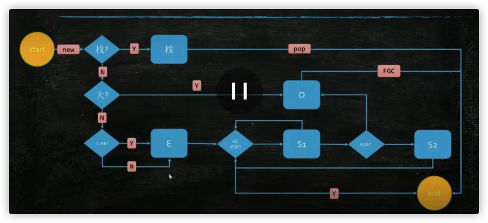

JVM

**垃圾回收**

Garbage Collector

1.什么是Garbage?

没有任何引用指向的一个对象，或者多个对象(循环引用)

2.如何找到garbage

- reference count 引用记数、不能解决循环引用
- root searching 根可达算法

根：jvm stack、native method stack、runtime constant pool、static references in metho area , Clazz

3.常见的垃圾回收算法

- Mark-Sweep 标记清除：  简单，碎片化
- Copying 复制算法：效率高、浪费空间
- Mark-Compact 标记压缩：节省空间，无碎片，效率偏低

中有这三种算法，垃圾回收器都是这三种的组合使用。

4.jvm分代算法

- 新生代：存活对象少，使用复制算法，效率高
- 老年代(永久代(1.7)，Metaspace(1.8))：垃圾少、一般使用标记压缩算法、g1使用复制算法

永久代必须指定大小限制；元数据区可以设置，也可不受限制，无上限。字符串常量1.7-永久代，1.8-堆

5.堆内存逻辑分区

新生代(eden+survivor+survivor)[复制算法] + 老年代(tenured)[标记压缩算法]

new:old = 1 : 3

eden:from:to = 8 : 1 : 1

-Xms: (设置最小堆大小) -Xmx:(设置最大堆大小) 堆大小=新生代+老年代

-Xmn: (设置新生代大小)

新生代满了-YGC (MinorGc)

老年代满了-FGC (MajorGc)

6.常见的垃圾回收器

**分代垃圾回收器**

Serial 年轻代 ：STW-复制算法-单GC线程

Serial Old 老年代：STW-标记压缩-单GC线程

Parallel Scavenge 年轻代：STW-复制算法-多GC线程

Parallel Old 老年代：STW-标记压缩-多GC线程

ParNew 年轻代：STW-复制算法-多GC线程，配合CMS使用

CMS(concurrent mark sweep) 老年代：

多数情况上下配合使用，但也可其它new-old配合使用

注：所有垃圾回收器都有STW stop-the-word 工作线程停止-->垃圾清理-->工作线程工作

对象啥时候进老年代：分代年龄到阀值(CMS默认6，其它15，最大数为15)

CMS：初始标记(标记根对象stw)-并发标记(工作线程同步工作)-重新标记(标记为垃圾但又有引用的对象)-并发清除。使用三色标记，但仍有并发漏标情况

**非分代垃圾回收器**

G1[Garbage first]（1.9默认）： 不再使用分代，把内存分成一块一块的空间Region，先清理垃圾最多的Region，所以叫Gargage First，每块中有一个Remember set记录有哪些引用指向我。SATB Snapshot At the Begining 在开始的时候做一个快照，当有一个引用消失时，把这个对象推到GC的堆栈，下次扫描的时候，从堆栈中拿出，并检查每个对象是否有其它引用(看Remember Set)指向自己无则回收。RS占用空间，不能避免FGC，且FGC时也很慢。stw-几百ms

ZGC(11引入)：(zero paused gc)1-10ms,跟内存多大无关

Shenandoah

Epsilon

总结：

分代:单线程GC-多线程GC(CMS)

分代-分区:G1

7.对象分配

